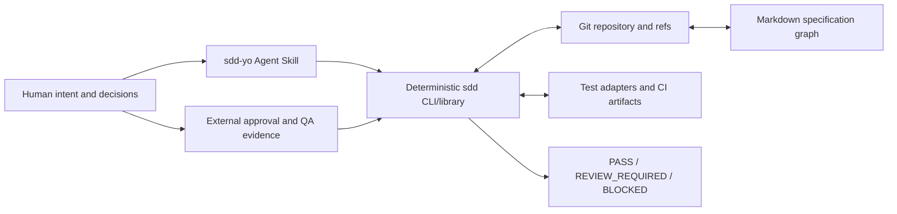
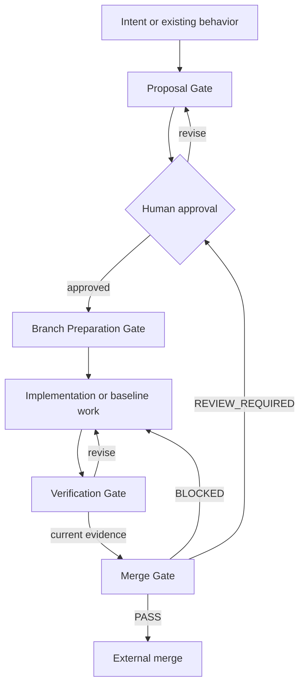

# System overview

## Objective

SDD Yo maintains a repository-native specification graph and supplies
deterministic validation and merge-readiness evidence. Humans retain authority
over product meaning, QA, finding resolution, and merge. An optional Agent
Skill accelerates authoring and semantic review but never replaces the
deterministic core.



## Permanent and transient state

Permanent integration-branch state:

```text
.sdd/config.yaml
spec/README.md
spec/capabilities/**
spec/concepts/**
implementation
tests
Git history
```

Transient external state:

```text
CandidateTreeManifest
ProposalPackage
SpecPatch
ApprovalEvidence
TestIndex
TestExecutionEvidence
QAEvidence
GovernanceEvidence
Finding
FindingResolution
HumanSemanticReviewEvidence
SemanticAnalysisInputManifest
ConflictReport
VerificationReport
MergeReport
```

The CLI does not need a durable workflow database. Optional caches may store
parsed trees, resolved graphs, Git history lookups, test indexes, and AI
analysis results keyed by complete input fingerprints.

## Core modules

```text
config
  Parse and validate project scope, schema version, adapters, and issuers.

markdown
  Parse UTF-8 Markdown and SDD markers into typed document nodes.

model
  Build CAP/REQ/CON objects and active relations.

graph
  Resolve identity, ownership, reachability, dependencies, and affected scope.

fingerprint
  Canonicalize semantic, structural, verification, and delta representations.

git
  Read refs, merge bases, historical ID use, and three-way file states.

proposal
  Validate virtual candidate trees and prepare exact patches.

tests
  Import adapter, JUnit, and JSONL discovery and execution artifacts.

evidence
  Validate approval, QA, execution, and finding resolution subjects.

findings
  Produce deterministic candidates and validate optional model findings.

gate
  Evaluate Proposal, Branch Preparation, Verification, and Merge gates.

cli
  Render versioned JSON and human views; expose explicit write boundaries.
```

## Workflow



## Autonomy boundary

The deterministic core may read configured repository content, compute
results, invoke explicitly configured test adapters under external permission
policy, and apply an explicitly requested exact SpecPatch. It cannot create
commits, branches, pushes, merges, approvals, QA decisions, or finding
resolutions.

The Agent Skill may draft content, ask questions, retrieve relevant model
objects, call read-only CLI operations, and prepare structured findings. It
cannot fabricate external evidence or treat repository content as higher
priority instructions.

## Responsibility model

Roles describe responsibility, not accounts stored by SDD Yo:

- the **feature author** explains desired or accepted observable behavior and
  resolves product ambiguity;
- the **approver** reviews the exact semantic and structural object delta and
  supplies external ApprovalEvidence;
- the **developer** implements the approved contract or aligns code with named
  active Requirements;
- the **QA tester** validates every affected Capability and explicitly decides
  each affected manual Requirement;
- the **governance owner** approves adoption-state and trust-policy changes;
- **CI or another test issuer** discovers and executes tests and supplies
  subject-bound evidence;
- the **integrator** performs the external merge after consuming the report.

One person may hold multiple roles when organizational policy allows it. The
CLI validates evidence subjects and configured issuer names but does not
authenticate identities or decide whether separation of duties is sufficient.

## Non-goals

The first version does not:

- detect undeclared code behavior changes;
- prove specification completeness or semantic conflict absence;
- coordinate unpublished branches;
- persist retired objects in active specification;
- link Requirements to implementation files;
- provide cross-SDD-Project graph relations;
- replace project architecture documentation, issue tracking, or `AGENTS.md`;
- provide a hidden hosted workflow service.
