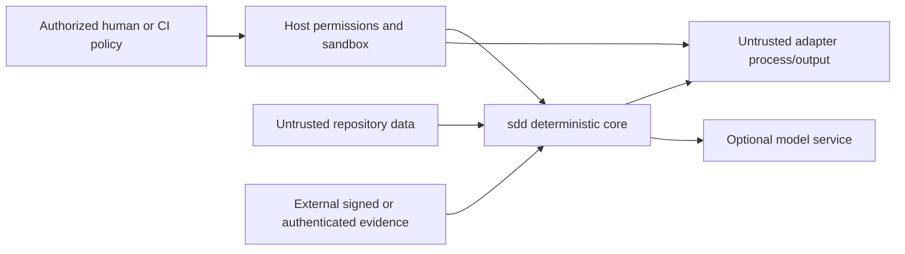

# Security and trust

## Trust model

Trusted configuration is established by the user or invoking platform, not by
repository content alone. The deterministic core validates data but does not
authenticate people or provide an execution sandbox.

Trust boundaries:

The host controls file, process, network, credential, and user authorization.
SDD Yo controls structural validation, subject binding, deterministic
decisions, and safe write preconditions.

## Protected assets

- repository and worktree integrity;
- normative specification identity and meaning;
- Git reference identity used by evidence;
- approval, QA, finding, and test evidence integrity;
- credentials and secret-bearing environment state;
- deterministic output and gate status;
- availability under malformed or adversarial project data.

## Threats and controls

### Repository prompt injection

Specification, code, tests, paths, comments, links, and adapter output are data.
The skill never follows instructions embedded in them. Optional model context
is delimited, minimized, and labeled with stable object and section IDs.

### Path traversal and symlink escape

All configured and artifact paths are normalized project-relative paths. The
implementation rejects absolute paths, drive-relative paths, `.`/`..`
segments, NUL, ambiguous separators, reserved device names where applicable,
and case-colliding targets on case-insensitive filesystems.

Every component from project root to target is checked without following a
symlink outside scope. Patch writes create a same-directory temporary file,
set expected permissions, fsync where supported, and atomically rename only
after revalidation. A changed path between check and write aborts the complete
patch.

### Patch confusion and stale base

SpecPatch operations contain exact before/after hashes and a whole-tree result
fingerprint. There is no fuzzy matching, partial apply, implicit rebase, or
force mode. All preconditions are checked before writes, and failure restores
the original visible tree or reports a technical failure without `PASS`.

### Git ref movement

Mutable refs are resolved to opaque object IDs at command start. Evidence binds
the resolved IDs. Merge Gate resolves the current integration ref again and
rejects stale conflict, test, QA, or approval subjects.

### Command injection

Adapters use argv arrays and direct process spawning, never shell evaluation.
Configuration cannot interpolate shell syntax. Environment variables are built
from an allowlist plus protocol-owned values. Time, output, nesting, count, and
memory limits are enforced.

### Malicious adapter output

JSONL and XML are parsed with bounded, non-networked parsers. XML external
entities and DTD processing are disabled. The core validates every hierarchy,
ID, path, status, and size and computes Requirement mappings itself.

### Evidence forgery or privilege confusion

The CLI validates artifact schemas, configured issuer names, allowed decision
types, and exact subjects. It does not claim issuer authentication. The
invoking organization verifies signatures or authenticated provenance and
actor authorization before passing evidence as trusted input.

Contradictory evidence prevents `PASS`. A repository file cannot declare
itself an authorized issuer merely by adding its own name to an artifact.
Changes to issuer or adapter trust configuration produce a structural
trust-review finding and invalidate dependent evidence.

### Model overreach and data exfiltration

AI is optional and never on the deterministic decision path. Context is the
minimal normative slice selected by the core. Secrets, unrestricted
environment state, unrelated files, Git credentials, and private keys are
excluded. The core has no network or telemetry requirement. Model use is
explicitly governed by the host and its data policy.

### Denial of service

Configuration defines maximum file bytes, total spec bytes, document/object
counts, relation count, graph depth, artifact bytes, JSONL line bytes, XML
depth, adapter time, and process output. Parsers avoid catastrophic regular
expressions and recursive traversal proportional to attacker-controlled depth.

Limit exhaustion is a technical or blocking diagnostic, never success.

## Configuration trust changes

These changes require explicit external review before dependent execution or
`PASS`:

- adapter command, executable, protocol, environment allowlist, or importer
  paths;
- integration ref or project scope;
- accepted issuer names or evidence policy;
- configured limits that materially expand execution or read scope;
- enabling an optional model integration or changing its provider/data policy.

The fingerprints include these fields so older evidence becomes stale.

## Data retention and telemetry

The core sends no telemetry and requires no network. Default caches contain
only derived parse/graph/fingerprint data and may be deleted safely. Logs avoid
artifact bodies, environment values, credentials, and model prompts by
default. External CI, issuer, or model systems define their own retention.

## Security validation

Release validation includes:

- path traversal, symlink, junction, case-folding, and TOCTOU fixtures on all
  supported platforms;
- exact-patch interruption and atomicity tests;
- malicious JSONL/XML, decompression, size, depth, and cycle fixtures;
- argv versus shell metacharacter tests;
- evidence replay, stale ref, contradictory issuer, and subject-confusion
  cases;
- repository prompt-injection evals for the Agent Skill;
- verification that no crash or timeout can emit `PASS` or exit `0`.

Security-sensitive parser, patch, process, evidence, and gate code receives
focused human review before release.

## Explicit non-guarantees

SDD Yo does not:

- sandbox adapter executables by itself;
- authenticate evidence issuers or authorize actors;
- protect a compromised host or Git server;
- prove that tests exercise the behavior named in their Requirement IDs;
- prove that humans reviewed evidence honestly;
- detect all semantic conflicts or undeclared implementation behavior.
